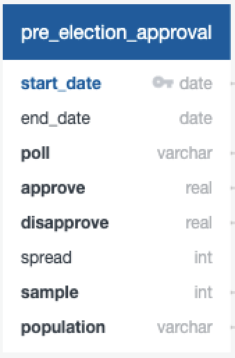
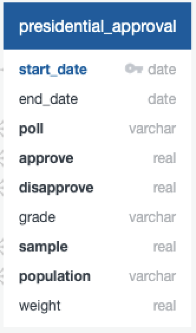
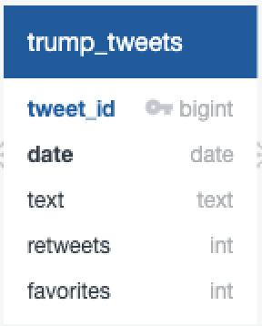
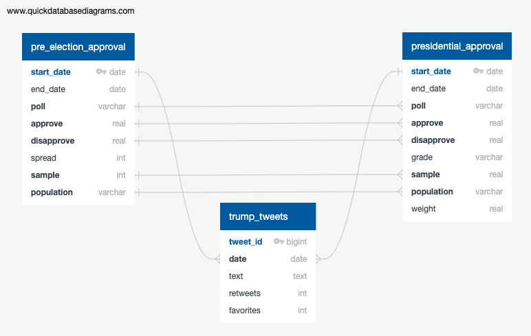

# Trump Tweets & Approval Rating ETL

  

## Summary ##

This project extracted, transformed and loaded Donald Trump's Tweets and his approval ratings from the 2016 pre-election year through all four years of his presidency. The data was extracted from various sources using different methods, which included downloading a CSV and a JSON file, parsing a HTML table from its URL, and querying Tweets directly from Twitter using the Python library GetOldTweets3. All data transformation was conducted using Python Pandas and saved as CSV output files. 

A relational database appropriate for the data was modeled and engineered using PostgreSQL. Finally, the output CSV files were loaded into the database from which queries could be run in order to analyze the data. Hypothetically, the queries could be structured to assess several aspects of the Tweets which would be useful to a campaign manager or agency concerned with how a political candidate or politician's Tweets affect public reaction and ultimately impacts the general population's approval of the candidate.

---

## Process ##

### Approval Rating Extraction and Transformation

#### 2016 Pre-election Year
* 2016 approval ratings were extracted from an html table on the website [Real Clear Politics](https://www.realclearpolitics.com/epolls/other/trump_favorableunfavorable-5493.html#polls) using Python Pandas "read_html" function to parse the URL into a data frame. 
* The data frame was then cleaned which including renaming and splitting columns, filtering for data from 2016, converting the date to a datetime format, dropping duplicate time frames, changing column order, and sorting the approval ratings according to date.
* The columns included "Start Date", "End Date", "Poll", "Approve (%)", "Disapprove (%)", "Spread", "Sample", and "Population".

  

* The cleaned data frame was saved as a new output CSV file ready to be loaded into the database.
#### 2017 - 2020 Presidential Years
* A CSV data set containing approval ratings during Trump's presidency was located and downloaded from the website [FiveThirtyEight](https://projects.fivethirtyeight.com/trump-approval-ratings).
* Columns were reordered to be consistent with the previous cleaned data frame, null value rows and duplicate 'Start Dates' were dropped, and the date was converted to a datetime format.

  

* The cleaned data frame was also saved as a new output CSV file ready to be loaded into the database.

### Tweet Extraction and Transformation

#### 2016 Tweets
* A [GitHub Repository](https://github.com/bpb27/trump_tweet_data_archive) containing JSON files of Trump's Tweets was located and the 2016 file was downloaded.
* The JSON file was loaded into Python using Pandas "read_json" function.
* The data frame was transformed which involved filtering for original Tweets (dropping Retweets), dropping unnecessary columns, renaming the columns, splitting the "Datetime" column into "Date" and "Time", and sorting the Tweets according to date.
* The remaining columns included "Tweet Id", "Date", "Time", "Text", "Retweets", and "Favorites".
* The cleaned data frame was then saved as a new output CSV file.

#### 2017-2020 Presidential Tweets
* Scraping Trump’s tweets from Twitter in Python was the most direct way of extracting the 2017-2020 Tweets, however the standard Twitter API only allows a retrieval of Tweets up to 7 days ago and is limited to scraping 18,000 Tweets per a 15 minute window. This wasn't practical given the 4-year time span of Tweets needing to be extracted. 
* Instead, there are two Python libraries that allow Twitter scraping. The first is [Tweepy](https://www.tweepy.org/), which uses Twitter's API and has limitations of up to 3,200 of the most recent Tweets by a single user. The second is [GetOldTweets3](https://pypi.org/project/GetOldTweets3/), which simply queries Tweets without limitations on the number of Tweets nor the date span. Both require simple PIP installs. GetOldTweets3 was a suitable library to use for this application.
* Once installed, a GetOldTweets3 query was coded which specified for Trump's Twitter ID "realDonaldTrump", dates spanning "2017-01-01" until "2020-09-02", and a maximum of 15,000 Tweets.
* Desired Tweet information was specified as a list comprehension, which included "id", "author_id", "username", "to", "text", "retweets", "favorites", "replies", "date", "formatted_date", "hashtags", "mentions", "urls", and "permalink"
* Once the data was scraped it was loaded into a Pandas data frame.    
* Transformation included selecting for Tweets that were not replies to another user, splitting the "Datetime" column into "Date" and "Time", removing the "Reply to" column, renaming the "Tweet Id" column to match the 2016 Tweet CSV file, and dropping all null value rows.
* The data frame was saved as another output CSV file.

#### Tweet Concatenation
* Pandas was used to combine the separate 2016 and 2017-2020 Tweet CSV files via the "pd.concat" function.

  

## Database Modeling and Engineering, and Data Loading
* A SQL Database was modeled for the three CSV files due to the relational nature of the table columns.
* Primary and foreign keys were determined as illustrated in the ERD diagrame below:

  

* PostgreSQL was used to create a database, constructing a table schema to match the above format in order properly load each CSV file.
* The data files were then loaded to the database.

---

## Sources ##
### Data
* [Twitter - @realDonaldTrump](https://twitter.com/realDonaldTrump)
* [2016 Tweets Archive](https://github.com/bpb27/trump_tweet_data_archive)
* [2016 Pre-election Approval Ratings](https://www.realclearpolitics.com/epolls/other/trump_favorableunfavorable-5493.html#polls)
* [2017-2020 Presidential Approval Ratings](https://projects.fivethirtyeight.com/trump-approval-ratings)
### Python Libraries
* [Get Old Tweets 3](https://pypi.org/project/GetOldTweets3/)
* [Tweepy](https://www.tweepy.org/)
### Trump Twitter Image
* [CNN](https://www.cnn.com/videos/politics/2018/11/02/trump-twitter-social-media-truth-tapper-fact-check-orig.cnn)

---

## Technologies Used ##
* Python - Pandas, Datetime, GetOldTweets3
* PyCharm - Python IDE
* Jupyter Notebook
* PostgreSQL
* pgAdmin 4 - PostgreSQL IDE
* JSON & CSV file

---

## Authors ##
Kiran Rangaraj - LinkedIn: [@Kiran Rangaraj](https://www.linkedin.com/in/kiranrangaraj/)

Michelle Hannah - LinkedIn: [@Michelle Hannah](https://www.linkedin.com/in/michelle-hannah-5a326258/)
